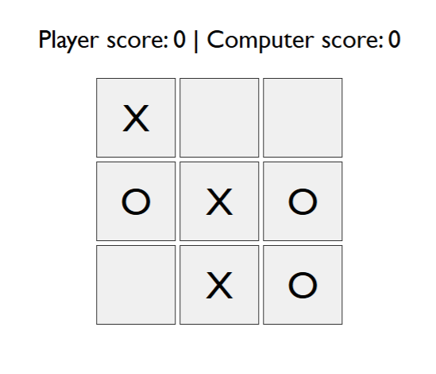

# tic-tac-toe

> A tic-tac-toe game in which the player competes against the computer to be the first to get three matching naughts or crosses in a row. An alert is displayed if the game results in a win or draw and the scores are updated accordingly.

## Table of contents

- [General info](#general-info)
- [Screenshots](#screenshots)
- [Technologies](#technologies)
- [Setup](#setup)
- [Live Application](#live-application)
- [Features](#features)
- [Status](#status)
- [Inspiration](#inspiration)
- [Contact](#contact)

## General info

A tic-tac-toe game against an AI player. Built to showcase my ability to program the AI, manipulate the DOM and make the layout responsive using flex and grid.

## Screenshots

## Technologies

- HTML
- CSS
- JavaScript

## Setup

Open the index.html in any modern browser.

## Live Application

[Live Application](https://sbillsborough.github.io/tic-tac-toe/)

## Features

- Player clicks the square in which they would like to place their marker.
- Winning moves are then checked and if the computer can make a winning move it does so or if the computer can block the player from winning it will do so.
- Alerts are displayed at the end of each round stating who has won or if the round was a draw.
- Scores are updated accordingly
- Fully responsive using flex and grid.

To-do list:

- Improve the accuracy of the 'winning move' check
- Add the ability to play against another human player
- Give the player the option to choose whether to play with O or X

## Status

Project is: _in progress_

## Inspiration

This tic-tac-toe game is inspired by The Odin Project and used to practise JavaScript fundamentals.

## Contact

Created by [@sbillsborough](https://github.com/sbillsborough) - feel free to contact me!
